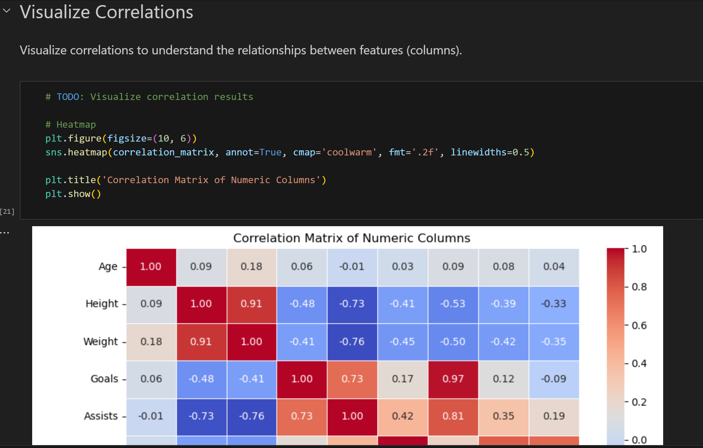
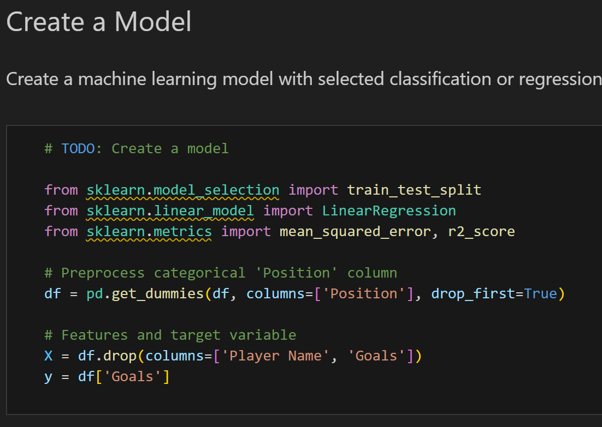

# Data Analytics and Machine Learning Basics - Spring 2025

This repository contains my completed assignments from the **Data Analytics & Machine Learning Basics** (TTC8020-3010) course at JAMK University of Applied Sciences.  
The work showcases foundational techniques in data preprocessing, exploratory analysis, and machine learning model implementation using Python and Jupyter Notebooks.
The course was led by Juha Peltomäki

## Skills Demonstrated
- Data cleaning and preprocessing  
- Exploratory data analysis (EDA)  
- Supervised learning (regression & classification)  
- Model evaluation and interpretation  
- Visualisation of results

### Assignments

* [Assignment 1](assignments_1_data_cleaning/assignment1_players_eda.ipynb)
* [Assignment 2](assignments_2_regression/assignment_2_titanic.ipynb)
* [Assignment 3](assignments_3_classification/assignment_3_football_db.md)

## Repository Structure
📁 **assignment1_data_cleaning** — Data preprocessing and EDA  
📁 **assignment2_regression** — Regression modelling and evaluation  
📁 **assignment3_classification** — Classification model development  

> Each assignment folder contains a Jupyter notebook with code, results, and markdown explanations.

## Preview

